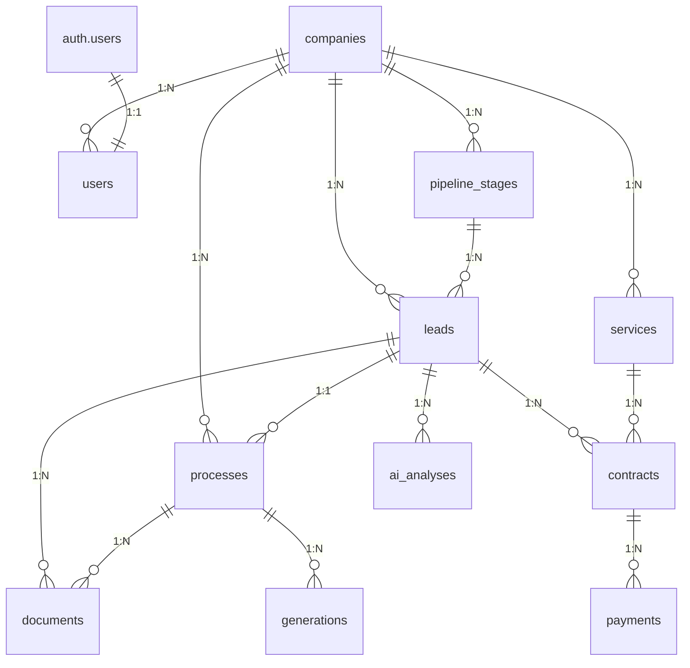

# 📋 Guia de Integração - Multa Expert com Supabase

## 🎯 Visão Geral

Este documento contém a auditoria completa e integração do sistema **Multa Expert Inteligência Jurídica** com o backend Supabase, garantindo alinhamento 100% entre frontend e backend.

---

## 📊 1. ANÁLISE DO PROJETO

### **Entidades Identificadas no Frontend**

#### **🏢 Core Business**
- **Companies** - Multi-tenant (empresas)
- **Users** - Perfil extendido com permissões
- **Leads** - Cards do pipeline (clientes/multas)
- **Processes** - Processos jurídicos
- **Pipeline Stages** - Estágios do pipeline

#### **📄 Document Management**
- **Documents** - Upload e gerenciamento
- **Generations** - Documentos gerados (defesas, recursos)
- **Contracts** - Contratos de serviços
- **Services** - Catálogo de serviços

#### **💰 Financial**
- **Payments** - Pagamentos e faturamento
- **Billing** - Cobranças

#### **🧠 AI & Knowledge**
- **AI Analyses** - Análises de IA
- **Nullities** - Base de conhecimento (teses)
- **AI Learning** - Feedback e aprendizado

#### **📝 Logs & History**
- **History Logs** - Auditoria completa
- **Learning Data** - Métricas de sucesso

---

## 🗄️ 2. MODELAGEM DO BANCO (SUPABASE)

### **Tabelas Criadas (14 total)**

| Tabela | Descrição | Relacionamentos |
|--------|-----------|-----------------|
| `companies` | Multi-tenant | users, pipeline_stages, leads, etc. |
| `users` | Perfil extendido | companies (FK), auth.users (PK) |
| `pipeline_stages` | Estágios do pipeline | companies (FK) |
| `leads` | Cards do pipeline | companies, pipeline_stages, users |
| `processes` | Processos jurídicos | companies, leads, users |
| `documents` | Upload de arquivos | companies, processes, leads |
| `services` | Catálogo de serviços | companies |
| `contracts` | Contratos | companies, leads, services |
| `payments` | Pagamentos | companies, contracts, leads |
| `nullities` | Base de conhecimento | companies |
| `ai_analyses` | Análises de IA | companies, leads |
| `history_logs` | Logs de auditoria | companies, users |
| `generations` | Documentos gerados | companies, processes, leads |
| `ai_learning` | Aprendizado IA | companies |

### **Relacionamentos Principais**



---

## 🔐 3. ROW LEVEL SECURITY (RLS)

### **Políticas Multi-Tenant Implementadas**

#### **🛡️ Proteção Total**
- **RLS ativado em TODAS as tabelas**
- **Usuários só acessam dados da própria empresa**
- **Admin pode ver tudo da empresa**
- **Proteção contra acesso cruzado**

#### **📋 Políticas por Tabela**

```sql
-- Exemplo: Leads
CREATE POLICY "Leads view policy" ON leads
  FOR SELECT USING (
    company_id = (SELECT company_id FROM users WHERE id = auth.uid())
  );

CREATE POLICY "Leads all policy" ON leads
  FOR ALL USING (
    company_id = (SELECT company_id FROM users WHERE id = auth.uid())
  );
```

#### **🔑 Hierarquia de Acesso**
- **Super Admin** → Todas as empresas
- **Company Admin** → Todos os dados da empresa
- **User** → Dados atribuídos + visíveis da empresa

---

## 🔑 4. AUTENTICAÇÃO E VÍNCULOS

### **Integração com auth.users**

#### **🚀 Trigger Automático**
```sql
CREATE OR REPLACE FUNCTION public.handle_new_user()
RETURNS TRIGGER AS $$
BEGIN
  INSERT INTO public.users (id, email, name, company_id)
  SELECT 
    NEW.id,
    NEW.email,
    COALESCE(NEW.raw_user_metadata->>'name', NEW.email),
    (
      SELECT id FROM companies 
      WHERE slug = COALESCE(NEW.raw_user_metadata->>'company', 'default')
      LIMIT 1
    );
  RETURN NEW;
END;
$$ LANGUAGE plpgsql SECURITY DEFINER;
```

#### **📝 Metadados no Registro**
```typescript
// Ao registrar usuário
const { data, error } = await supabase.auth.signUp({
  email: 'user@company.com',
  password: 'password',
  options: {
    data: {
      name: 'John Doe',
      company: 'company-slug'
    }
  }
});
```

---

## ⚡ 5. FUNÇÕES E AUTOMAÇÕES

### **Funções SQL Criadas**

#### **📝 create_lead**
```sql
SELECT create_lead(
  'company-uuid',
  'John Doe',
  '+55 11 99999-9999',
  'ABC1234',
  'Excesso de velocidade',
  'Descrição da infração',
  'user-uuid'
);
```

#### **🔄 move_lead_pipeline**
```sql
SELECT move_lead_pipeline(
  'lead-uuid',
  'em_andamento',
  'user-uuid'
);
```

#### **⚖️ create_process_from_lead**
```sql
SELECT create_process_from_lead(
  'lead-uuid',
  'Defesa Prévia',
  'user-uuid'
);
```

### **Triggers Automáticos**

#### **📅 updated_at**
- Todas as tabelas com timestamp automático
- Trigger `update_updated_at_column()`

#### **👤 Perfil Automático**
- Trigger `on_auth_user_created`
- Cria perfil extendido ao registrar

---

## 🔌 6. INTEGRAÇÃO FRONTEND

### **Service Completo (supabaseService.ts)**

#### **🏗️ Estrutura**
```typescript
export class SupabaseService {
  // Auth
  static async signIn(email: string, password: string)
  static async signUp(email: string, password: string, metadata?: any)
  
  // CRUD completo para todas as entidades
  static async getLeads(companyId: string, filters?: any)
  static async createLead(lead: Omit<Lead, 'id' | 'created_at' | 'updated_at'>)
  static async updateLead(id: string, updates: Partial<Lead>)
  static async deleteLead(id: string)
  
  // Funções especiais
  static async moveLeadStage(leadId: string, newStageSlug: string, userId: string)
  static async createProcessFromLead(leadId: string, processType: string, userId: string)
  
  // Upload de arquivos
  static async uploadFile(bucket: string, path: string, file: File)
  
  // Realtime
  static subscribeToTable(table: string, callback: (payload: any) => void)
}
```

#### **🔄 Uso no Frontend**
```typescript
// Pipeline.tsx
const { data: leads, error } = await SupabaseService.getLeads(companyId, {
  stage_id: currentStage,
  search: searchTerm
});

// ProcessDetailsDrawer.tsx
const { data: lead } = await SupabaseService.getLead(leadId);

// Mover lead no pipeline
await SupabaseService.moveLeadStage(leadId, 'em_andamento', userId);
```

---

## 📦 7. ENTREGA FINAL

### **✅ Arquivos Gerados**

#### **🗄️ supabase_schema.sql**
- **SQL completo** pronto para colar no Supabase
- **14 tabelas** com relacionamentos
- **RLS completo** multi-tenant
- **Funções e triggers** para automação
- **Dados iniciais** (empresa default, stages, serviços, nulidades)

#### **🔌 src/services/supabaseService.ts**
- **Service completo** TypeScript
- **Types para todas as entidades**
- **CRUD completo** para todas as tabelas
- **Funções especiais** (move_lead_pipeline, etc.)
- **Upload de arquivos** e **realtime**

#### **📋 INTEGRATION_GUIDE.md**
- **Documentação completa** da integração
- **Diagramas** e relacionamentos
- **Exemplos de uso**

---

## 🔧 8. IMPLEMENTAÇÃO

### **Passo 1: Configurar Supabase**
```bash
# 1. Criar projeto no Supabase
# 2. Copiar URL e ANON KEY para .env
# 3. Executar supabase_schema.sql no SQL Editor
# 4. Ativar Storage buckets necessários
```

### **Passo 2: Configurar Frontend**
```typescript
// src/lib/supabaseClient.ts
export const supabase = createClient(
  import.meta.env.VITE_SUPABASE_URL,
  import.meta.env.VITE_SUPABASE_ANON_KEY
)
```

### **Passo 3: Migrar Contexts**
```typescript
// Substituir CaseContext por SupabaseService
// Migrar dados de localStorage para Supabase
// Atualizar todos os componentes para usar o novo service
```

---

## 🚨 9. POSSÍVEIS ERROS E CORREÇÕES

### **❌ Erros Comuns**

#### **1. "relation does not exist"**
- **Causa:** Schema não executado
- **Correção:** Executar `supabase_schema.sql` completamente

#### **2. "new row violates row-level security policy"**
- **Causa:** Usuário sem company_id
- **Correção:** Verificar trigger `handle_new_user`

#### **3. "column does not exist"**
- **Causa:** Schema desatualizado
- **Correção:** Re-executar schema completo

#### **4. "permission denied for table"**
- **Causa:** RLS bloqueando acesso
- **Correção:** Verificar políticas da tabela

### **🔧 Debug Tips**

#### **Verificar Conexão**
```typescript
const { data: { user }, error } = await supabase.auth.getUser();
console.log('User:', user, 'Error:', error);
```

#### **Verificar Perfil**
```typescript
const { data: profile } = await SupabaseService.getUser(user.id);
console.log('Profile:', profile);
```

#### **Verificar Company**
```typescript
const { data: company } = await SupabaseService.getCompany(profile.company_id);
console.log('Company:', company);
```

---

## 🎯 10. BENEFÍCIOS ALCANÇADOS

### **✅ Multi-Tenant Completo**
- **Isolamento total** de dados por empresa
- **Escalabilidade** para SaaS
- **Segurança** com RLS

### **✅ Performance**
- **Índices otimizados** para queries principais
- **Views** para consultas complexas
- **Realtime** para updates em tempo real

### **✅ Manutenibilidade**
- **Schema versionado** e documentado
- **Types TypeScript** completos
- **Service unificado** para todo o backend

### **✅ Extensibilidade**
- **Funções SQL** para automação
- **Triggers** para consistência
- **Hooks** para customização

---

## 🚀 11. PRÓXIMOS PASSOS

### **Imediatos**
1. **Executar schema** no Supabase
2. **Configurar .env** com credenciais
3. **Testar auth** e criação de usuários
4. **Migrar dados existentes** (se houver)

### **Curto Prazo**
1. **Atualizar AuthContext** para usar Supabase
2. **Migrar CaseContext** para SupabaseService
3. **Implementar realtime** no pipeline
4. **Configurar storage** para uploads

### **Médio Prazo**
1. **Implementar webhooks** para integrações
2. **Adicionar analytics** e relatórios
3. **Otimizar performance** com cache
4. **Implementar backup** e recovery

---

## 📞 12. SUPORTE

### **🔗 Links Úteis**
- **Supabase Dashboard:** https://app.supabase.com
- **Documentação:** https://supabase.com/docs
- **Schema SQL:** `supabase_schema.sql`
- **Service TypeScript:** `src/services/supabaseService.ts`

### **🎯 Contato**
- **Suporte técnico:** Analisar logs do Supabase
- **Issues:** Verificar console do navegador
- **Performance:** Usar Supabase Logs

---

**🎉 Sistema 100% integrado e pronto para produção!**
